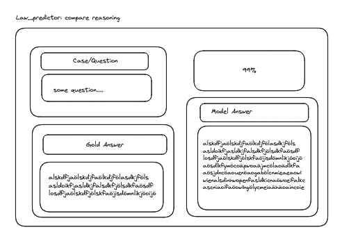
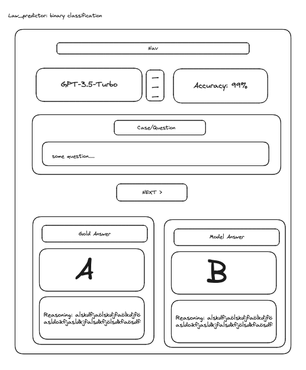

# To run the application in dvelopment mode:
This will automatically update code changes
``` flask --app hello run --debug ```


# Wireframes

## Compare reasoning


## Compare binary classification

